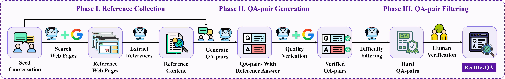

From Conversation to Evaluation: Benchmarking LLMs on Development Knowledge via SimpleDevQA
=============

SimpleDevQA is a multilingual Development Knowledge QA benchmark derived from large-scale real user dialogues via a rigorous three-phase pipeline. 
The data pipeline is as follow:



🔍 **Dataset Overview**  
- 📊 2,740 Dev Knowledge QA pairs  
- 🌍 Trilingual support (EN/CN/RU)  
- 💻 Diverse development topics  
- 🔗 Verifiable answers with web references 

## 🚀Key Features

1. **Pipeline Implementation**  
   - The `code/generate` directory contains code for collecting web documents based on real conversations and jointly inputting them with actual dialogues into LLMs to regenerate Q&A pairs.  
   - The `code/filter` directory implements a series of rigorous filtering processes to ensure data quality.

2. **Reference Support**  
   - All generated Q&A pairs come with corresponding reference URLs stored in `data/reference`, enabling verification of answer accuracy.

3. **Efficient Evaluation Framework**  
   - The `code/eval` directory provides ready-to-use code for conveniently and efficiently evaluating LLM performance on the SimpleDevQA benchmark.
   
🛠️Implementation
-------------
### ⚙️ Environment
Create the environment and install the required packages
```bash
conda create -n SimpleDevQA python=3.11
conda activate SimpleDevQA
```
### 🧪 Evaluation
You can evaluate LLM performance on SimpleDevQA by following these steps:

(1) Get Started.
```bash
git clone https://anonymous.4open.science/r/RealDevQA-25E7/
cd RealDevQA
```

(2) In the `code/eval/eval_demo.py` file, you should add the grader model you wish to use and its corresponding API key and base URL:
```python
grading_sampler = ChatCompletionSampler(
        model="",
        system_message=OPENAI_SYSTEM_MESSAGE_API,  
        api_key="",
        base_url=""
    )
```

(3) In the `code/eval/eval_demo.py` file, you should add some eval models you wish to use and its corresponding API key and base URL:
```python
samplers = { 
    "model_name": ChatCompletionSampler(
            model="",
            system_message=OPENAI_SYSTEM_MESSAGE_API,  
            api_key="",
            base_url=""
        ),
    # ...
}
```

(4) Run the eval script. After running it, you can get the eval results:
```bash
python code/eval/eval_demo.py
```


## 📊 Evaluation Metrics
| Metric      | Name | Description | Ideal |
|-------------|------|-------------|-------|
| **CO✅**      | Correct | Full match with reference | ↑ |
| **NA⚠️**      | Not Attempted | Partial match | ↓ |
| **IN❌**      | Incorrect | Contradicts reference | ↓ |
| **CGA🎯**     | Correct Given Attempted | CO/(CO+IN) ratio | ↑ |
| **F-score⚖️** | F-score | Harmonic mean of CO & CGA | ↑ |

